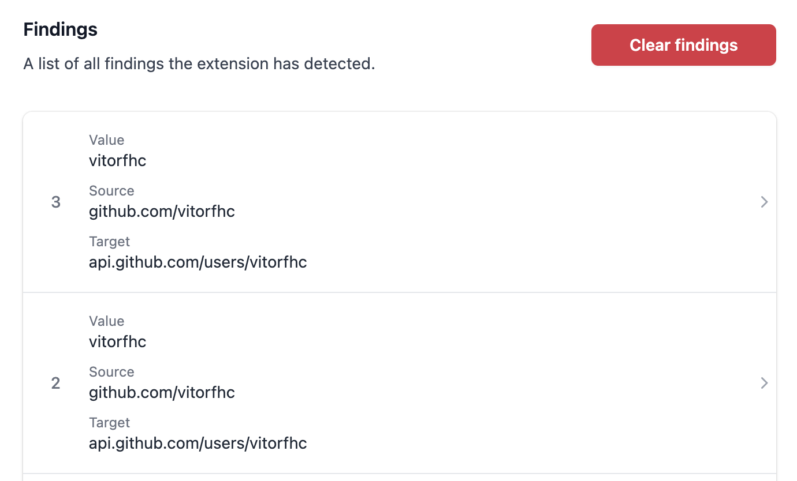

# Gecko 🦎

Gecko is a powerful Chrome extension designed to automate the discovery of Client-Side Path Traversals (CSPT) in web applications. It seamlessly integrates with Chrome DevTools and provides a user-friendly interface for identifying and analyzing CSPT vulnerabilities.



## Features

- **Automated CSPT Discovery:** Automatically detect potential CSPT vulnerabilities in web applications.
- **DevTools Integration:** View all findings in a dedicated DevTools panel.
- **Settings Panel:** Configure the extension settings using the popup window.
- **Real-Time Alerts:** Displays a badge with the number of current findings directly on the extension icon.

## Getting Started

### Prerequisites

Before you begin, ensure you have the following installed on your machine:

- [Node.js](https://nodejs.org/)
- [npm](https://www.npmjs.com/)

### Installation

1. Clone the repository:

   ```bash
   git clone https://github.com/your-username/gecko.git
   cd gecko
   ```

2. Install the required dependencies:

   ```bash
   npm install
   ```

3. Build the project:

   ```bash
   npm run build
   ```

4. The build process will create a `dist` folder containing all the necessary files for the extension.

### Loading the Extension into Chrome

1. Open Chrome and go to `chrome://extensions/`.
2. Enable **Developer mode** (toggle switch in the top-right corner).
3. Click on **Load unpacked**.
4. Select the `dist` folder inside the `gecko` directory.

The extension should now be loaded and visible in the Chrome toolbar.

### Using Gecko

1. **View Findings in DevTools:**

   - Open Chrome DevTools.
   - Go to the `Gecko` panel to see a detailed list of findings and potential vulnerabilities.

2. **Configure Settings:**

   - Click on the Gecko extension icon in the Chrome toolbar to open the settings popup.
   - Adjust the configuration options as needed.

3. **Monitor Findings:**
   - The Gecko extension icon displays a badge indicating the number of current findings in real-time.

## Contributing

We welcome contributions from the community! If you'd like to contribute, please follow these steps:

1. Fork the repository.
2. Create a new branch (`feature/your-feature-name`).
3. Make your changes and commit them (`git commit -m 'Add some feature'`).
4. Push to the branch (`git push origin feature/your-feature-name`).
5. Open a pull request.
