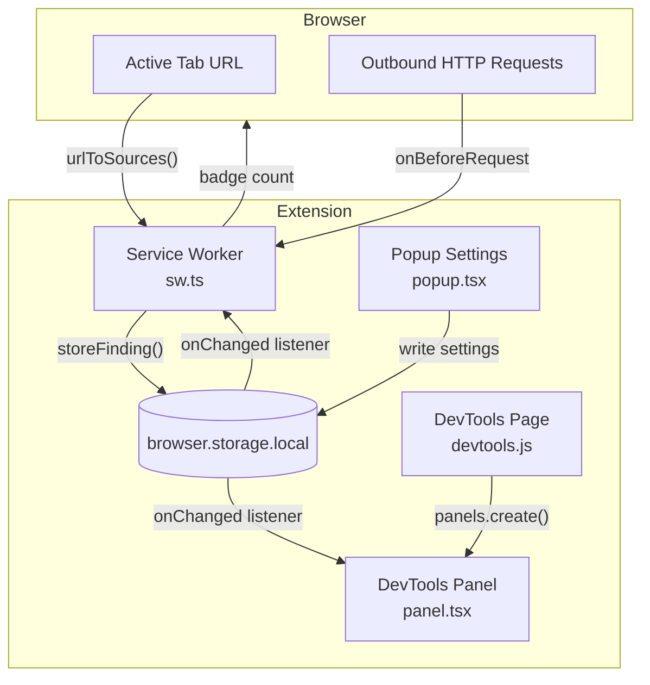
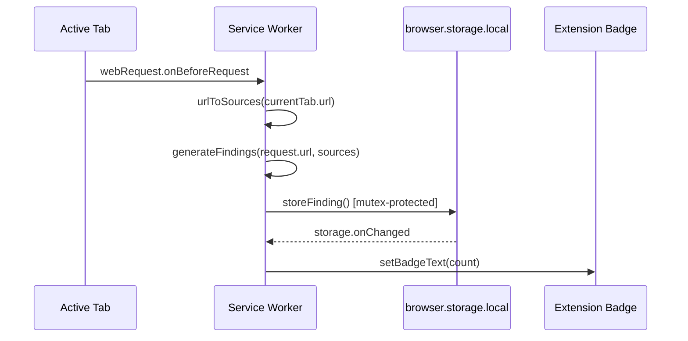
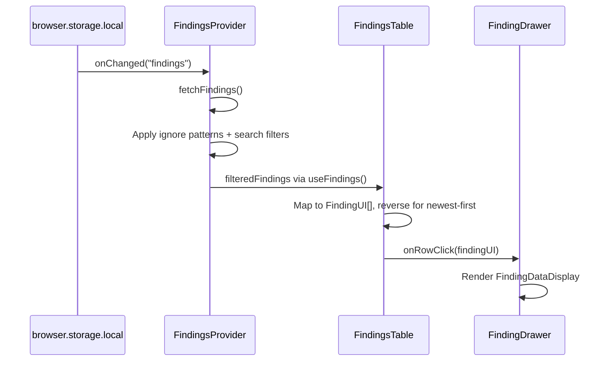
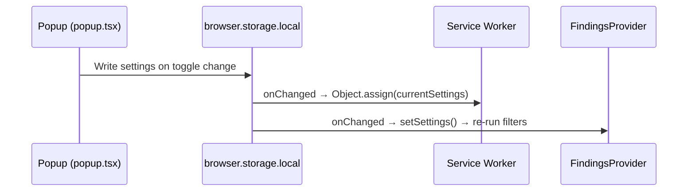

# Codebase Map

> Auto-generated by Cartographer. Last mapped: 2026-04-13T20:09:39Z

## System Overview

Gecko is a cross-browser (Chrome/Firefox) Manifest V3 extension that automates discovery of **Client-Side Path Traversals (CSPT)**. It intercepts outbound HTTP requests via a service worker, extracts "sources" (query parameter values, path segments, null/undefined literals) from the active tab's URL, and checks whether any source value appears in the path of the intercepted request. Matches are called **findings** and are surfaced in a DevTools panel.



## Directory Structure

```
gecko/
├── public/                        # Static assets copied to dist/
│   ├── icons/                     # Extension icons (48px, 96px)
│   ├── js/
│   │   └── devtools.js            # Hand-authored DevTools panel registration (not bundled)
│   ├── devtools.html              # DevTools page entry point
│   ├── manifest-chrome.json       # Chrome MV3 manifest
│   ├── manifest-ff.json           # Firefox MV3 manifest
│   ├── panel.html                 # DevTools panel React shell
│   └── popup.html                 # Browser action popup React shell
├── src/
│   ├── components/
│   │   ├── ui/                    # Stateless presentation components
│   │   │   ├── empty-findings.tsx # Empty state placeholder
│   │   │   ├── highlithed-text.tsx# Text highlighting with URL awareness (filename typo)
│   │   │   ├── info-alert.tsx     # Blue informational alert box
│   │   │   ├── search-input.tsx   # Reusable search input with icon
│   │   │   └── toggle.tsx         # Accessible on/off switch (Headless UI)
│   │   ├── finding-data-display.tsx  # Detail view for a single finding
│   │   ├── finding-drawer.tsx        # Slide-over drawer (Headless UI Dialog)
│   │   ├── findings-context.tsx      # React Context: state, filtering, storage sync
│   │   ├── findings-search.tsx       # Simple + advanced search bar
│   │   └── findings-table.tsx        # Main findings list with export/clear
│   ├── pages/
│   │   ├── panel.tsx              # DevTools panel entry point (Webpack: panel.js)
│   │   └── popup.tsx              # Popup settings entry point (Webpack: popup.js)
│   ├── shared/
│   │   ├── constants.ts           # Default settings object
│   │   └── types.ts               # All TypeScript interfaces and enums
│   ├── sw/
│   │   └── sw.ts                  # Service worker: CSPT detection engine
│   └── tailwind/
│       └── styles.css             # Tailwind CSS entry (@tailwind directives)
├── tests/
│   ├── index.html                 # Manual test: query-value-to-path CSPT
│   └── test/
│       └── path.html              # Manual test: path-to-path CSPT
├── Dockerfile                     # Node 20 Alpine build image
├── build-docker.sh                # Docker build helper (chrome|ff)
├── package.json                   # Scripts, dependencies, metadata
├── postcss.config.js              # Tailwind + autoprefixer
├── tailwind.config.js             # Content paths, custom danger color
├── tsconfig.json                  # TypeScript config (IDE only, not used by webpack)
├── webpack.config.js              # 3 entry points, babel-loader, copy plugin
├── README.md                      # Project documentation
├── PRIVACY.md                     # Privacy policy for Chrome Web Store
└── todo.md                        # Development task tracker
```

## Module Guide

### Service Worker (`src/sw/sw.ts`)

**Purpose**: Core CSPT detection engine — intercepts all outbound requests and matches them against values extracted from the active tab URL.

**Key files**:
| File | Purpose | Tokens |
|------|---------|--------|
| `src/sw/sw.ts` | Request interception, source extraction, finding generation, storage | ~1,530 |

**Key functions**:
- `urlToSources(url)` — Parses the active tab URL; emits `Source[]` for each query param value (raw, encoded, decoded), each path segment (raw, encoded, decoded), and optionally `"undefined"`/`"null"` literals.
- `generateFindings(url, sources)` — Splits the target request URL path by `/`; checks each segment against each source value (exact or partial match, case-insensitive per settings). Hard-ignores `adservice.google.com` and `ad.doubleclick.net`.
- `storeFinding(finding)` — Mutex-protected read-modify-write to `browser.storage.local`. Deduplicates via `findingsCache` keyed by `${source.url}-${source.value}-${target.url}`.
- `updateCurrentTab()` — Queries active tab and caches it module-level.

**Event listeners**: `webRequest.onBeforeRequest`, `tabs.onActivated`, `tabs.onUpdated`, `webNavigation.onCommitted`, `storage.local.onChanged`.

**Dependencies**: `webextension-polyfill`, `async-mutex`, `shared/types`, `shared/constants`.

**Gotchas**:
- `storeFinding` is called per-finding in a loop with no batching — each acquires the mutex separately. Acknowledged by a `// TODO` comment.
- Cache key does not include `SourceType`, so two sources with the same URL and value but different types are treated as duplicates.
- `currentSettings` is mutated via `Object.assign` on storage changes — races with in-flight `onBeforeRequest` callbacks.
- `partialMinLength` check is per-source-value, not global.

---

### Shared Types & Constants (`src/shared/`)

**Purpose**: Central type definitions and default configuration shared by all layers.

| File | Purpose | Tokens |
|------|---------|--------|
| `src/shared/types.ts` | Enums (`SourceType`), interfaces (`Source`, `Target`, `Finding`, `FindingUI`, `Settings`, `Search`) | ~283 |
| `src/shared/constants.ts` | `defaultSettings` object with all scanner/matching/display/filter defaults | ~96 |

**Default settings**: All scanners on, partial matching off, case-insensitive on, `partialMinLength: 3`, `clearOnRefresh: false`, empty ignore patterns.

**Gotchas**:
- `SourceType` enum values are human-readable strings (e.g., `"Query Parameter (URL encoded)"`) used directly as UI labels.
- `sw.ts` deep-clones `defaultSettings` via `JSON.parse(JSON.stringify(...))` to avoid reference aliasing.

---

### Findings Context (`src/components/findings-context.tsx`)

**Purpose**: React Context provider that owns all findings state, filtering logic, and storage synchronization for the DevTools panel.

| File | Purpose | Tokens |
|------|---------|--------|
| `src/components/findings-context.tsx` | Context provider, storage listeners, filter pipeline | ~1,185 |

**Exports**: `FindingsProvider`, `useFindings()` hook.

**Context value**: `{ findings, clearFindings, refreshFindings, search, setSearch }`.

**Filter pipeline** (runs on every change to `search`, `rawFindings`, or `settings`):
1. **Ignore patterns**: Each pattern from `settings.filters.ignorePatterns` compiled as `RegExp`, tested against target URL pathname. Invalid patterns silently ignored.
2. **Search terms**: Space-split tokens with `-prefix` negation (AND logic across all terms per field).

**Dependencies**: `webextension-polyfill`, `shared/types`, `shared/constants`.

**Gotchas**:
- Two separate `storage.local.onChanged` listeners (settings + findings) in the same component.
- `clearFindings` sets local state to `[]` immediately AND writes to storage, causing a redundant re-read when the storage listener fires.
- Negative search syntax (`-term`) is not documented in the UI.

---

### Findings Table & Search (`src/components/findings-table.tsx`, `findings-search.tsx`)

**Purpose**: Main data table listing findings with search, export, and clear controls.

| File | Purpose | Tokens |
|------|---------|--------|
| `src/components/findings-table.tsx` | Table rendering, export JSON, clear, row click handling | ~1,391 |
| `src/components/findings-search.tsx` | Simple/advanced search mode toggle with SearchInput fields | ~379 |

**Export behavior**: Creates a `Blob` of `JSON.stringify(findings)`, triggers a synthetic anchor click. Exports the **unfiltered** findings from context, not the currently visible filtered set.

**Dependencies**: `findings-context`, `findings-search`, `ui/highlithed-text`, `ui/empty-findings`, `@heroicons/react`.

**Gotchas**:
- `.reverse()` mutates the findings array in place — a code smell though not currently causing bugs.
- Export downloads unfiltered findings, which may surprise users who applied filters.
- `FindingsTable` imports `tailwind/styles.css` — `panel.tsx` relies on this transitive import.

---

### Finding Detail View (`src/components/finding-drawer.tsx`, `finding-data-display.tsx`)

**Purpose**: Slide-over drawer showing full detail for a selected finding.

| File | Purpose | Tokens |
|------|---------|--------|
| `src/components/finding-drawer.tsx` | Headless UI Dialog slide-over panel | ~640 |
| `src/components/finding-data-display.tsx` | Structured detail display (value, source, target, type) | ~614 |

**Dependencies**: `@headlessui/react`, `@heroicons/react`, `ui/highlithed-text`, `shared/types`.

**Gotchas**:
- `new URL(...)` calls in `finding-data-display.tsx` are unguarded — malformed URLs would throw.
- `"use client"` directive in `finding-drawer.tsx` is a Next.js artifact with no effect.
- Target URL in detail view shows full URL (with protocol), while the table shows protocol-stripped version.

---

### UI Primitives (`src/components/ui/`)

**Purpose**: Stateless, reusable presentation components.

| File | Purpose | Tokens |
|------|---------|--------|
| `src/components/ui/toggle.tsx` | Accessible toggle switch (Headless UI Switch) | ~394 |
| `src/components/ui/search-input.tsx` | Search input with optional label and icon | ~396 |
| `src/components/ui/highlithed-text.tsx` | Text highlighting with URL-aware splitting | ~362 |
| `src/components/ui/info-alert.tsx` | Blue informational alert box | ~161 |
| `src/components/ui/empty-findings.tsx` | Empty state placeholder | ~102 |

**Gotchas**:
- `highlithed-text.tsx` filename is misspelled (should be "highlighted") — consistent across all imports.
- `empty-findings.tsx` imports `PlusIcon` but never uses it (dead import).
- `search-input.tsx` passes optional `value` prop directly to `<input>` — `undefined` causes controlled/uncontrolled switch warning.

---

### Pages / Entry Points (`src/pages/`)

**Purpose**: Webpack entry points that bootstrap independent React trees.

| File | Purpose | Tokens |
|------|---------|--------|
| `src/pages/panel.tsx` | DevTools panel — FindingsTable + FindingDrawer inside FindingsProvider | ~291 |
| `src/pages/popup.tsx` | Browser action popup — settings toggles, ignore patterns textarea | ~1,317 |

**Gotchas**:
- `popup.tsx` has a subtle race: `useEffect([settings])` writes `defaultSettings` to storage on initial render before the async storage read completes.
- `panel.tsx` does not clear `selectedFinding` on drawer close — intentional for smooth exit animation.
- Both files bootstrap via `createRoot(document.getElementById("root"))` at module evaluation time.

---

### Browser Integration (`public/`)

**Purpose**: Static assets, HTML shells, and manifest definitions copied to `dist/` by CopyWebpackPlugin.

| File | Purpose | Tokens |
|------|---------|--------|
| `public/manifest-chrome.json` | Chrome MV3 manifest (ES module service worker) | ~148 |
| `public/manifest-ff.json` | Firefox MV3 manifest (`scripts` array fallback) | ~153 |
| `public/devtools.html` | Invisible DevTools page that loads devtools.js | ~27 |
| `public/js/devtools.js` | Registers the Gecko panel via `panels.create()` | ~44 |
| `public/panel.html` | React shell for DevTools panel | ~69 |
| `public/popup.html` | React shell for browser action popup | ~69 |

**Chrome vs Firefox differences**:
| Aspect | Chrome | Firefox |
|--------|--------|---------|
| Background type | `"type": "module"` | Absent (classic script) |
| Background field | `service_worker` only | `service_worker` + `scripts` array |

**Gotchas**:
- `devtools.js` uses manual `window.browser || window.chrome` polyfill — NOT `webextension-polyfill`.
- `public/manifest.json` is `.gitignore`d — generated at build time by copying the platform-specific manifest.
- Both manifests include `browser_specific_settings.gecko.id` — harmless on Chrome, required by Firefox.

---

### Build System

| File | Purpose | Tokens |
|------|---------|--------|
| `webpack.config.js` | 3 entry points, babel-loader, CSS pipeline, CopyWebpackPlugin | ~319 |
| `package.json` | Scripts, dependencies (v0.1.0 in package.json vs v1.6.1 in manifests) | ~417 |
| `tsconfig.json` | TypeScript config for IDE type-checking (not used by webpack) | ~73 |
| `tailwind.config.js` | Content paths, custom `danger`/`danger-dark` colors | ~89 |
| `postcss.config.js` | Tailwind + autoprefixer plugins | ~20 |
| `Dockerfile` | Node 20 Alpine build image | ~83 |
| `build-docker.sh` | Docker build helper (`chrome` or `ff` argument) | ~191 |

**Webpack entry points**:
| Entry | Source | Output |
|-------|--------|--------|
| `popup` | `src/pages/popup.tsx` | `dist/js/popup.js` |
| `panel` | `src/pages/panel.tsx` | `dist/js/panel.js` |
| `sw` | `src/sw/sw.ts` | `dist/js/sw.js` |

**Gotchas**:
- `devtool: "inline-source-map"` is set at top level and NOT removed for production builds — production bundles include source maps.
- `ts-loader` and `webpack-merge` are installed but unused.
- No `splitChunks` — React and shared deps are duplicated across `popup.js` and `panel.js`.
- CSS is injected via `style-loader` (runtime `<style>` tags), not extracted to `.css` files.
- `CleanWebpackPlugin` and `output.clean` are both present (redundant).
- Docker volume mount `$(pwd):/app` shadows the image's `node_modules` — host must have deps installed.

---

### Tests (`tests/`)

| File | Purpose | Tokens |
|------|---------|--------|
| `tests/index.html` | Manual test: query param value reflected into XHR path (3 variants) | ~458 |
| `tests/test/path.html` | Manual test: path segment reflected into XHR path | ~334 |

No automated test framework — purely manual trigger pages for verifying extension detection. Requires serving on a web server with the extension loaded.

## Data Flow

### CSPT Detection (Service Worker)



### Findings Display (DevTools Panel)



### Settings Flow



## Storage Schema

`browser.storage.local` keys:

| Key | Type | Description |
|-----|------|-------------|
| `findings` | `Finding[]` | All detected CSPT findings |
| `findingsCache` | `Record<string, boolean>` | Dedup index, keyed by `${source.url}-${source.value}-${target.url}` |
| `settings` | `Settings` | User configuration (scanners, matching, display, filters) |

## Conventions

- **TypeScript + React 18** with classic JSX transform (`jsx: "react"`)
- **Tailwind CSS 3** for styling with custom `danger` (#DC3444) and `danger-dark` (#BF2D3A) color tokens
- **Headless UI** for accessible interactive components (Dialog, Switch)
- **Heroicons** for SVG icons (mixed `/16/solid`, `/20/solid`, `/24/outline` variants)
- **`webextension-polyfill`** for cross-browser API normalization (except `devtools.js` which uses manual polyfill)
- **`browser.storage.local`** as the single shared state bus — no `runtime.sendMessage` used
- **Named exports** preferred over default exports for shared modules
- **No router or state management library** — React Context for panel, local state for popup

## Gotchas

1. **Race condition in popup.tsx**: The `useEffect([settings])` write-back fires on initial render with `defaultSettings` before the async storage read completes, potentially overwriting stored settings briefly.
2. **Unguarded `new URL()` calls** in `finding-data-display.tsx` — malformed stored URLs would throw with no error boundary.
3. **`.reverse()` mutation** in `findings-table.tsx` mutates the context array reference in place.
4. **Export vs. display mismatch**: Export downloads unfiltered findings, not the currently visible filtered set.
5. **Source maps in production**: `devtool: "inline-source-map"` is not overridden for production builds.
6. **Filename typo**: `highlithed-text.tsx` (missing second 'h' in "highlighted") — consistent across all imports.
7. **Dead imports**: `PlusIcon` in `empty-findings.tsx`, `ts-loader` and `webpack-merge` in `package.json`.
8. **Dedup cache key** omits `SourceType` — different source types with same URL+value+target are treated as duplicates.
9. **Docker volume mount** shadows container's `node_modules` — host must have dependencies installed.
10. **Version mismatch**: `package.json` says `0.1.0`, manifests say `1.6.1`.

## Navigation Guide

**To modify CSPT detection logic**: `src/sw/sw.ts` — `urlToSources()` for source extraction, `generateFindings()` for matching.

**To add a new scanner type**: Add to `SourceType` enum in `src/shared/types.ts`, update `defaultSettings` in `src/shared/constants.ts`, add extraction logic in `src/sw/sw.ts:urlToSources()`, add toggle in `src/pages/popup.tsx`.

**To modify the findings display**: `src/components/findings-table.tsx` for the table, `src/components/finding-data-display.tsx` for the detail view.

**To change filtering/search behavior**: `src/components/findings-context.tsx` — the filter `useEffect`.

**To add a new UI component**: Create in `src/components/ui/`, import in the consuming page/component. Follow Headless UI + Tailwind pattern.

**To add a new settings toggle**: Add field to `Settings` interface in `types.ts`, set default in `constants.ts`, add `Toggle` in `popup.tsx`, read in `sw.ts` or `findings-context.tsx`.

**To build for Chrome**: `npm run build:chrome` → output in `dist/`.

**To build for Firefox**: `npm run build:ff` → output in `dist/`.

**To build via Docker**: `./build-docker.sh chrome` or `./build-docker.sh ff`.
